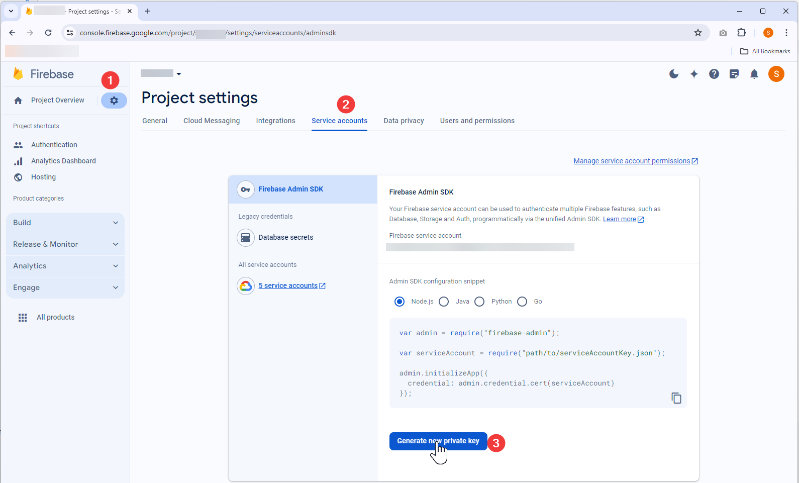

# Verify Firebase User Email

> Activate test environment users programatically

1. Generate adminsdk cert Firebase Console -> Project Settings -> Service Accounts -> Firebase Admin SDK -> Generate new private key 
2. Clone the repo
3. Copy the downloaded key into the repo
4. Rename the json file to `service-account.json`
5. Run `npm install`
6. Run `npm start <user-uuid>` - get the user uuid from firebase console (Authentication -> Users)
7. Done!

> PS C:\repo\firebase> npm start jOBMx7EqhVWqmF2P7u7KW96B5675
>
> firebase-verify-email@1.0.0 start  
> node index.js jOBMx7EqhVWqmF2P7u7KW96B5675
>
> User email verified! You can log in now user@email.com
